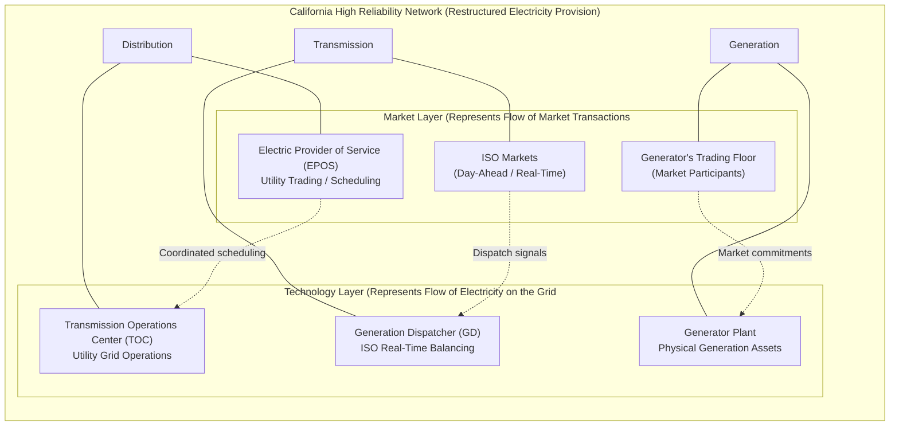

```mermaid
flowchart TB
    %% Main container
    subgraph HRN["California High Reliability Network (Restructured Electricity Provision)"]
        direction TB

        %% MARKET LAYER
        subgraph M["Market Layer (Represents Flow of Market Transactions"]
            direction LR
            EPOS["Electric Provider of Service (EPOS)\nUtility Trading / Scheduling"]
            ISOM["ISO Markets\n(Day-Ahead / Real-Time)"]
            TF["Generator's Trading Floor\n(Market Participants)"]
        end

        %% TECHNOLOGY LAYER
        subgraph T["Technology Layer (Represents Flow of Electricity on the Grid"]
            direction LR
            TOC["Transmission Operations Center (TOC)\nUtility Grid Operations"]
            GD["Generation Dispatcher (GD)\nISO Real-Time Balancing"]
            GP["Generator Plant\nPhysical Generation Assets"]
        end

        %% COLUMN HEADERS (visual alignment cue)
        D["Distribution"]
        TR["Transmission"]
        G["Generation"]

        %% Align columns (invisible anchors)
        D --- EPOS
        D --- TOC

        TR --- ISOM
        TR --- GD

        G --- TF
        G --- GP

        %% Cross-layer coupling (core HRO insight)
        EPOS -. Coordinated scheduling .-> TOC
        ISOM -. Dispatch signals .-> GD
        TF -. Market commitments .-> GP
    end
```
