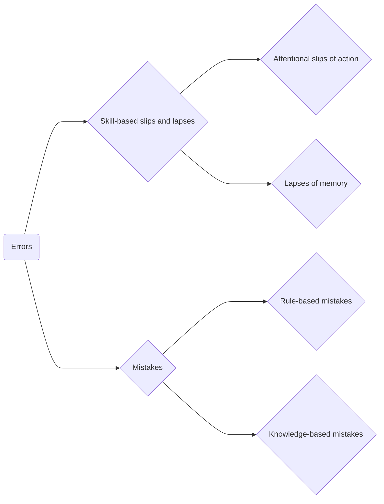

```mermaid
flowchart LR

A(Errors) ---> B{Skill-based slips and lapses}
A ---> C{Mistakes}

B--->D{Attentional slips of action}
B--->E{Lapses of memory}

C--->F{Rule-based mistakes}
C--->G{Knowledge-based mistakes}


```
