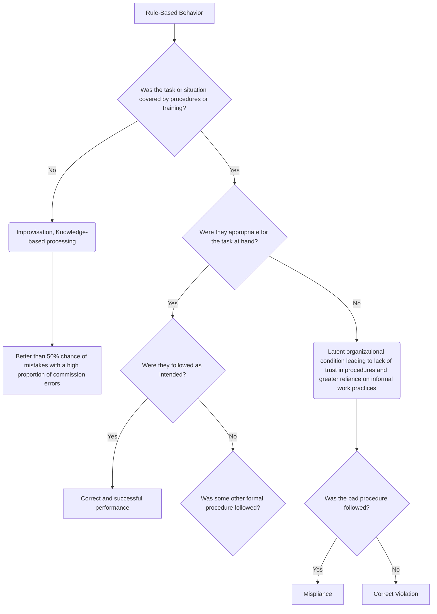

```mermaid
flowchart TD
A[Rule-Based Behavior] --> B{Was the task or situation covered by procedures or training?}

B --> |Yes| C{Were they appropriate for the task at hand?}
B --> |No| D(Improvisation, Knowledge-based processing)
D --> E[Better than 50% chance of mistakes with a high proportion of commission errors]

C --> |Yes| F{Were they followed as intended?}
C --> |No| G(Latent organizational condition leading to lack of trust in procedures and greater reliance on informal work practices)

F --> |Yes| H[Correct and successful performance]
F --> |No| I{Was some other formal procedure followed?}

G --> J{Was the bad procedure followed?}
J -->|Yes| K[Mispliance]
J -->|No| L[Correct Violation]


```
