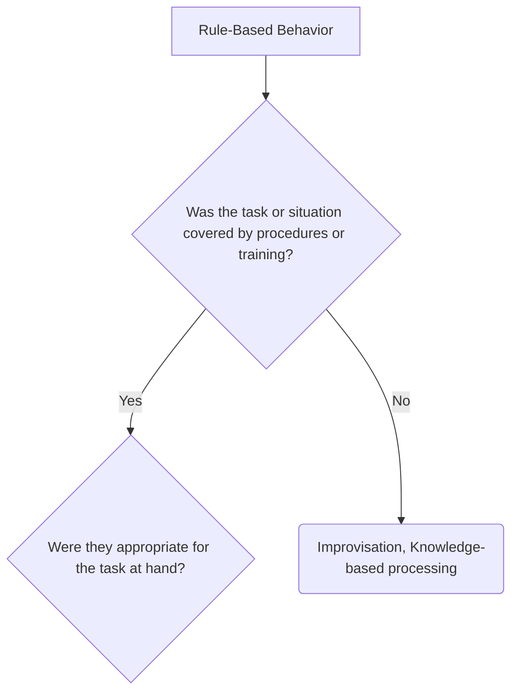

```mermaid
flowchart TD
A[Rule-Based Behavior] --> B{Was the task or situation covered by procedures or training?}

B --> |Yes| C{Were they appropriate for the task at hand?}
B --> |No| D(Improvisation, Knowledge-based processing) 
```
