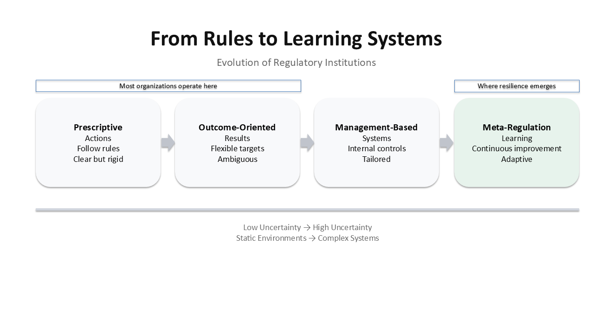

# From Rules to Learning Systems  
### Evolution of Regulatory Institutions

---

## Overview

This model adapts Gilad (2010) to illustrate the progression of regulatory institutions from static rule-based systems to adaptive, learning-oriented systems.

It highlights a critical shift:

> Regulation evolves from prescribing behavior → to enabling organizational learning under uncertainty.

---

## The Four Stages

### 1. Prescriptive Regulation
- Focus: Actions
- Logic: Follow defined rules
- Strength: Clarity and enforceability
- Limitation: Poor fit for complex or dynamic environments

---

### 2. Outcome-Oriented Regulation
- Focus: Results
- Logic: Achieve specified outcomes
- Strength: Flexibility
- Limitation: High interpretation burden on firms

---

### 3. Management-Based Regulation
- Focus: Systems and controls
- Logic: Firms design internal compliance systems
- Strength: Tailored to organizational context
- Limitation: Requires regulators to assess system quality

---

### 4. Meta-Regulation
- Focus: Learning systems
- Logic: Continuous evaluation and improvement
- Strength: Adaptive, builds long-term capability
- Limitation: Requires high regulatory and organizational capacity

---

## Key Insight

Most organizations stop at designing compliance systems.

Very few develop **learning systems** that continuously improve performance.

---

## Connection to Research

This model underpins the development of the **Compliance Capability Maturity Model (CCMM)** and ongoing research into regulatory effectiveness under uncertainty.

---

## Source

Adapted from:

Gilad, S. (2010). *It runs in the family: Meta-regulation and its siblings*. Regulation & Governance.
